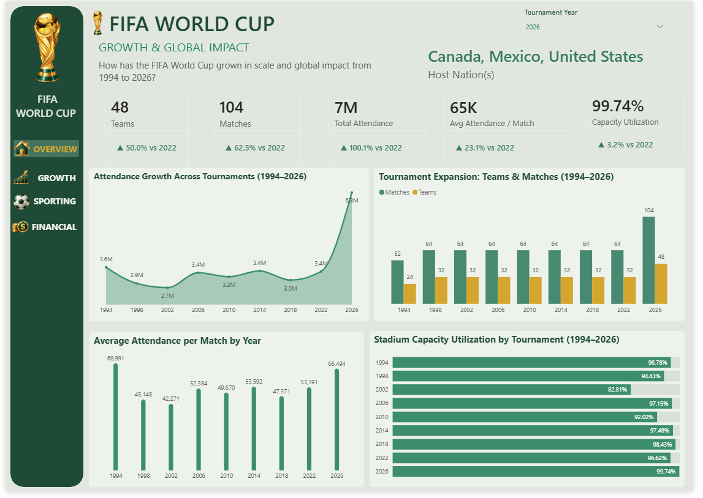
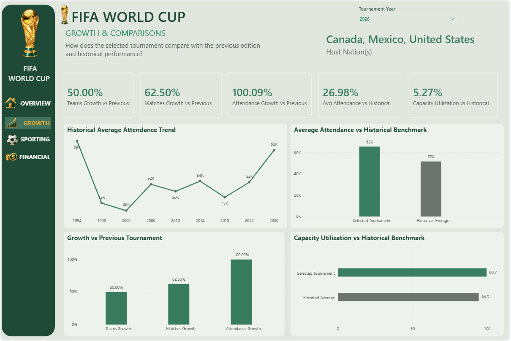
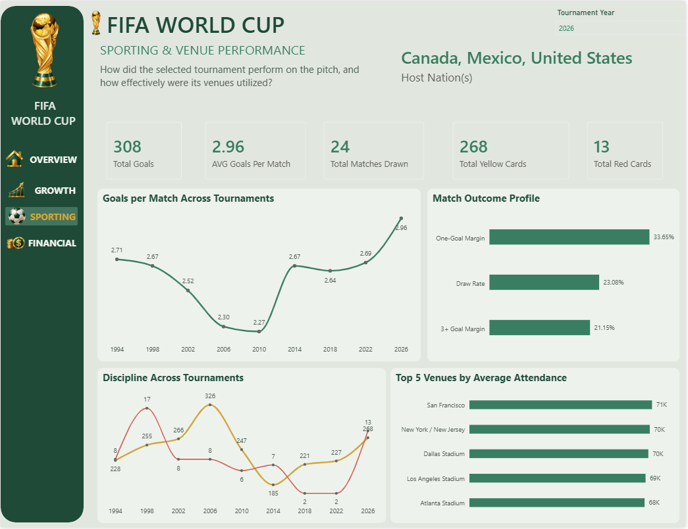
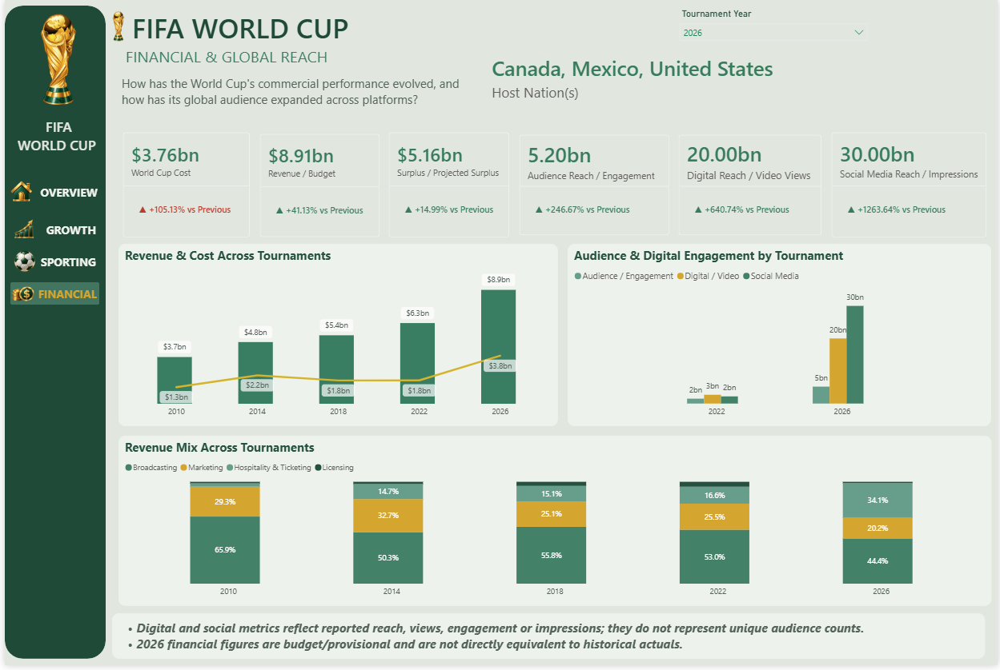

# FIFA World Cup Evolution: Evaluating Tournament Success from 1994 to 2026

> An end-to-end PostgreSQL, SQL and Power BI analytics project examining how the modern FIFA World Cup evolved in scale, stadium demand, sporting performance, commercial performance and global reach.

## Project origin

This project started with a sitting-room argument while the 2026 FIFA World Cup was underway.

The debate was simple: **was the 2026 World Cup genuinely a poor tournament, or did the data tell a different story?**

Instead of continuing from opinions, I converted the argument into an analytical problem. I researched the evidence, built a relational PostgreSQL database, cleaned and validated the data, wrote SQL analysis and reporting views, created DAX comparison measures and built a four-page Power BI report.

## Central analytical question

**How has the modern FIFA World Cup evolved since USA 1994, and was the 2026 tournament genuinely successful for both FIFA and football fans?**

## Why 1994–2026?

The original concept covered every World Cup from 1930. The final comparison begins in 1994 because the modern period provides stronger and more comparable evidence for attendance, stadium capacity, commercial performance and global audience measures. USA 1994 also provides a natural North American benchmark for the Canada–Mexico–United States 2026 edition.

## Technology stack

`PostgreSQL` `SQL` `Power BI` `DAX` `Relational Data Modelling` `Data Cleaning` `Data Validation` `Window Functions` `Business Intelligence` `Data Visualisation` `Analytical Storytelling`

## Project deliverables

| Deliverable | Access |
|---|---|
| PostgreSQL database | [Download / inspect SQL dump](database/fifa_world_cup_database(1994%20-%202026).sql) |
| SQL analysis | [Browse SQL scripts](sql/) |
| Power BI source | [Download PBIX](powerbi/FIFA_World_Cup_Evolution_1994_2026.pbix) |
| Full project report | [Open PDF report](report/FIFA_World_Cup_Evolution_1994_2026_Report.pdf) |
| Methodology | [Read methodology](docs/methodology.md) |
| Data model | [View model documentation](docs/data_model.md) |
| Data dictionary | [View data dictionary](docs/data_dictionary.md) |
| DAX | [View DAX patterns](powerbi/dax_measures.md) |

## Dashboard preview

### 1. Growth & Global Impact

### 2. Growth & Comparisons

### 3. Sporting & Venue Performance

### 4. Financial & Global Reach

## End-to-end workflow

1. Defined the analytical problem, scope and success framework.
2. Collected tournament, match, stadium, attendance, sporting, ticketing, financial and audience evidence.
3. Built a relational PostgreSQL database.
4. Standardised identifiers, names, tournament years and measurement definitions.
5. Corrected historical stadium-capacity mappings and audited utilisation denominators.
6. Validated relationships, missing values, duplicate risks and reporting status using SQL.
7. Built analytical SQL queries and database views.
8. Connected the validated data to Power BI.
9. Created DAX measures for dynamic KPIs, baseline handling and previous-valid-tournament comparison.
10. Built four interactive dashboard pages and produced the final evidence-based verdict.

## Database architecture

The repository includes the **complete PostgreSQL database dump** used for the project. The database contains **16 physical tables and 9 analytical views**, covering tournament, match, attendance, venue, team, player, squad, event, ticketing, financial and audience subject areas.

The model deliberately separates different analytical grains rather than forcing all metrics into one flat table. Match-level attendance and sporting records can therefore be aggregated safely while tournament-level financial and audience measures remain at their appropriate grain.

See the [database restoration guide](database/README.md), [data model](docs/data_model.md) and [data dictionary](docs/data_dictionary.md).

## SQL analysis

The SQL layer includes:

- [Core analysis queries](sql/analysis_queries.sql)
- [Data-quality validation](sql/01_data_quality_validation.sql)
- [Tournament growth & previous-edition comparison](sql/02_growth_comparison_analysis.sql)
- [Sporting & venue analysis](sql/03_sporting_venue_analysis.sql)
- [Financial, audience & ticket-demand analysis](sql/04_financial_audience_analysis.sql)

Techniques demonstrated include multi-table `JOIN`s, `GROUP BY`, aggregation, calculated metrics, conditional aggregation with `FILTER`, CTEs, window functions such as `LAG()`, NULL-safe division with `NULLIF()`, exception auditing and analytical views.

## Power BI & DAX

The `.pbix` source is included so the semantic model and dashboard can be inspected directly. The report uses a tournament dimension to control year context across the pages, while DAX measures handle dynamic KPIs, baseline states and comparisons against the previous tournament with a valid observation.

Representative DAX logic is documented in [powerbi/dax_measures.md](powerbi/dax_measures.md).

## Key 2026 findings

| Metric | 2026 result | Interpretation |
|---|---:|---|
| Teams | 48 | +50.0% vs 2022 |
| Matches | 104 | +62.5% vs 2022 |
| Total attendance | ~7.0M | Approximately double 2022 in the completed dataset |
| Average attendance | ~65K | Strong per-match demand, not only more fixtures |
| Capacity utilisation | 99.74% | Near-full stadium utilisation |
| Goals | 308 | 2.96 per match |
| World Cup cost | $3.76bn | 2026 budget/provisional basis |
| Revenue / budget | $8.91bn | 2026 budget/provisional basis |
| Projected surplus | $5.16bn | Analytical revenue/budget less cost |
| Audience / engagement | 5.20bn | Reported engagement measure |
| Digital / video views | 20.00bn | Reported digital/video measure |
| Social impressions | 30.00bn | Reported social-media measure |

## Key analytical insight

The strongest finding is that the 2026 attendance record cannot be explained by tournament expansion alone.

More matches naturally create more opportunities to accumulate attendance. However, **average attendance also increased materially and capacity utilisation reached 99.74%**. Tournament scale and genuine stadium demand therefore increased together.

## Final verdict

**The measurable performance evidence does not support describing the 2026 FIFA World Cup as a poor tournament overall.**

The evidence supports strong performance in structural scale, stadium demand, sporting output, commercial potential and global/digital engagement.

This does not prove that every supporter had a positive experience. Comparable historical evidence for ticket affordability, travel burden, visa accessibility and subjective fan satisfaction is less complete, so those criticisms are kept separate from the core performance verdict.

## Reproducibility

A technical reviewer can recreate the analytical environment by restoring the SQL dump into PostgreSQL and running the SQL scripts in this repository. The PBIX file is provided for inspection of the semantic model, DAX and dashboard design, while the PNG exports allow the final report to be reviewed directly in GitHub without Power BI Desktop.

## Documentation

- [Full analytical report](report/FIFA_World_Cup_Evolution_1994_2026_Report.pdf)
- [Methodology](docs/methodology.md)
- [Data model](docs/data_model.md)
- [Data dictionary](docs/data_dictionary.md)
- [Key findings](docs/key_findings.md)
- [Limitations](docs/limitations.md)
- [Dashboard exports](report/)

## Data and rights note

Underlying FIFA/tournament facts remain attributable to their respective original data sources. This repository documents the project's database compilation, transformations, SQL analysis, model design, dashboard construction and original analytical interpretation.

---

**Project & analysis: Ibraheem Ibraheem (Bleezysmart)**  
**2026**
